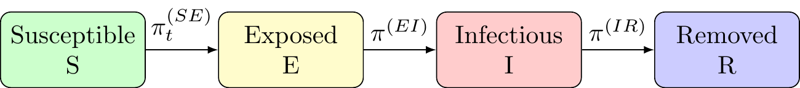

# Overview

BayesSEIR is an R Package designed to simulate and fit stochastic SEIR
models using various methods to model the infectious period.

## Installation

The BayesSEIR package can be installed from Github using the following
command.

``` r
devtools::install_github("ceward18/BayesSEIR")
```

## Model formulation



BayesSEIR implements a fully Bayesian discrete-time population-averaged
SEIR model for epidemic spread. The SEIR model includes four
compartments, **S**usceptible, **E**xposed, **I**nfectious, and
**R**emoved/**R**ecovered. The model assumes a closed population of size
*N*. Let *t* = 1, ..., *τ* indicate discrete calendar time since the
epidemic began and *S*<sub>*t*</sub>, *E*<sub>*t*</sub>,
*I*<sub>*t*</sub>, and *R*<sub>*t*</sub> denote the number of
individuals in the susceptible, exposed, infectious, and removed
compartment in the time interval (*t*, *t* + 1\], respectively.
Furthermore, define *E*<sub>*t*</sub><sup>\*</sup>,
*I*<sub>*t*</sub><sup>\*</sup>, and *R*<sub>*t*</sub><sup>\*</sup> to
represent the number of individuals that transition into the indicated
compartment in this interval.

The stochastic SEIR model formulates the counts of newly exposed,
infectious, and removed individuals as a series of binomial equations:

*E*<sub>*t*</sub><sup>\*</sup> ∼ *B**i**n*(*S*<sub>*t*</sub>, *π*<sub>*t*</sub><sup>(SE)</sup>)

*I*<sub>*t*</sub><sup>\*</sup> ∼ *B**i**n*(*E*<sub>*t*</sub>, *π*<sup>(EI)</sup>)

*R*<sub>*t*</sub><sup>\*</sup> ∼ *B**i**n*(*I*<sub>*t*</sub>, *π*<sup>(IR)</sup>)

The transition probabilities, *π*<sub>*t*</sub><sup>(SE)</sup>,
*π*<sup>(EI)</sup>, and *π*<sup>(IR)</sup> are of primary interest.
BayesSEIR assumes the transmission probability is written as

*π*<sub>*t*</sub><sup>(SE)</sup> = 1 − exp ( − *e*<sup>*θ*<sub>*t*</sub></sup>*I*<sub>*t*</sub>/*N*)

where *θ*<sub>*t*</sub> = *X*<sub>*t*</sub>′**β**, *X*<sub>*t*</sub> is
a 1 × *p* row-vector, and **β** is a *p* × 1 vector used to describe the
intensity process.

BayesSEIR uses an exponential distribution to describe the time spent in
the latent period, which translates to a probability of

*π*<sup>(EI)</sup> = 1 − exp ( − *ρ*<sub>*E*</sub>)

BayesSEIR offers three possible methods for specifying the infectious
period:

1.  Exponentially distributed:

*π*<sup>(IR)</sup> = 1 − exp ( − *ρ*<sub>*I*</sub>)

2.  Path-specific as specified in Porter and Oleson (2013)

*π*<sup>(IR)</sup> = *P*(*W* ≤ *w* + 1\|*W* &gt; *w*)

where *W* can follow an exponential, gamma, or Weibull distribution.

3.  Infectious duration-dependent transmission

*π*<sub>*t*</sub><sup>(SE)</sup> = 1 − exp \[ − *e*<sup>*θ*<sub>*t*</sub></sup>(*Σ**f*(*w*)*I*<sub>wt</sub>)/*N*\]

where the duration of the infectious period is fixed at
*T*<sub>*I*</sub> days and *f*(*w*) &gt; 0 describes a curve of
transmissibility over each individual’s infectious period. BayesSEIR
offers four functions that can be used to specify *f*(*w*), the gamma
PDF, the log normal PDF, a logistic decay function, and a function
derived from splines.
